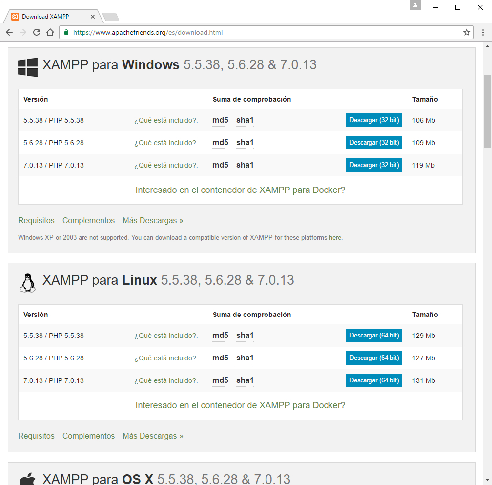

# LARAVEL

Laravel es un framework de código abierto para desarrollar aplicaciones y servicios web con PHP. Su filosofía es desarrollar código PHP de forma elegante y simple, evitando el "código espagueti". Fue creado en 2011 y tiene una gran influencia de frameworks como Ruby on Rails, Sinatra y ASP.NET MVC.

# Configuración previa.

* Tener un servidor web y composer

1- En este tutorial utilizacermos XAMPP que es un paquete que permite levantar un servidor apache y utilizar bases de datos MySQL.
Instalar [XAMPP](https://www.apachefriends.org/es/download.html)

