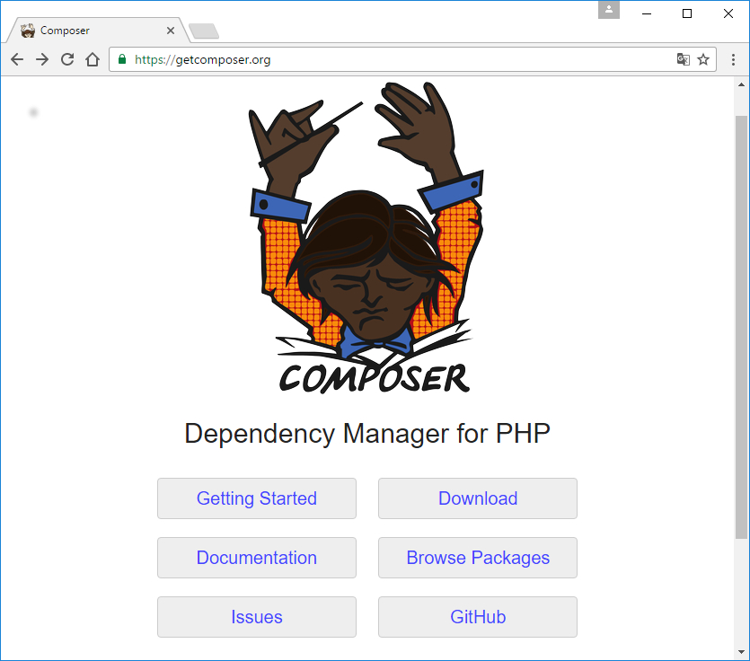

# LARAVEL

Laravel es un framework de código abierto para desarrollar aplicaciones y servicios web con PHP. Su filosofía es desarrollar código PHP de forma elegante y simple, evitando el "código espagueti". Fue creado en 2011 y tiene una gran influencia de frameworks como Ruby on Rails, Sinatra y ASP.NET MVC.

# Configuración previa.

* Tener un servidor web y composer

1- En este tutorial utilizaremos XAMPP que es un paquete que permite levantar un servidor apache y utilizar bases de datos MySQL.

Instalar [XAMPP](https://www.apachefriends.org/es/download.html)

2- Composer es una herramienta de administración de dependencias para PHP. Está altamente inspirado en el NPM de NODEJS o el Bundler de Ruby. Para instalar composer entramos en [https://getcomposer.org](https://getcomposer.org/), hacemos clic en Download e instalamos el paquete que corresponda a nuestro Sistema Operativo.

